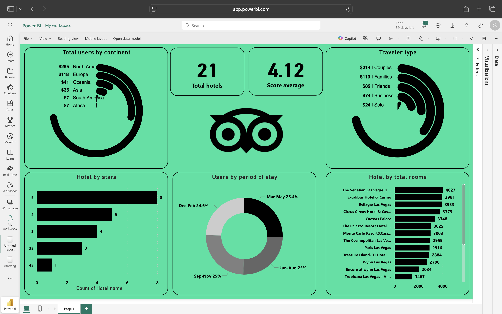

# 🏨 Tripadvisor - Hotel Insights Dashboard – Power BI

This Power BI dashboard provides key insights into hotel statistics including user demographics, hotel distribution, and traveler preferences. It's designed to help stakeholders understand the trends and patterns in hotel usage across different regions and traveler types.

## 📊 Dashboard Features

- **Total Users by Continent**: Visual representation of user count per continent.
- **Traveler Type Breakdown**: Couples, Families, Friends, Business, Solo.
- **Total Hotels & Average Score**: Quick KPIs showing total hotels (21) and average user rating (4.12).
- **Hotel by Stars**: Bar chart representing the distribution of hotels based on their star ratings.
- **Users by Period of Stay**: Donut chart illustrating user distribution across different seasons.
- **Hotel by Total Rooms**: Horizontal bar chart showing the largest hotels by room count (e.g., The Venetian Las Vegas, Bellagio, Caesars Palace).

## 📦 Tech Stack

- **Tool**: Power BI
- **Data Source**: Hotel reviews and metadata (likely from TripAdvisor or similar platforms)
- **Visuals Used**:
  - KPIs
  - Donut Charts
  - Bar Charts
  - Custom Icons/Branding

## 🧠 Insights Gained

- North America has the highest number of hotel users.
- Couples are the most common type of travelers.
- 5-star hotels are the most prevalent.
- Most users visit between March–August.

## 📸 Preview

## 📝 Author

- Dashboard by Mariam Raafat
- Created as part of a data visualization learning journey

